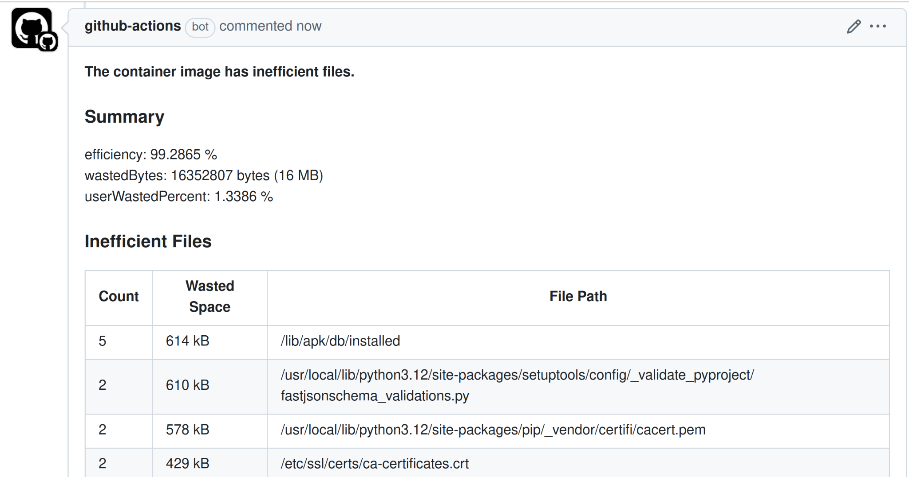

# dive action

[![Release][release-badge]][release]
[![GitHub Marketplace][marketplace-badge]][marketplace]
[![License][license-badge]][license]




dive action is an action that allows developers who develop Docker image to run
[dive](https://github.com/joschi/dive) on GitHub Actions. dive is a tool for
exploring a docker image, layer contents, and discovering ways to shrink the
size of your Docker/OCI image. Integrating dive into your CI will let you
reduce your container image size as early as possible.

## **Usage**

### Inputs

| Name&nbsp;&nbsp;&nbsp;&nbsp;&nbsp;&nbsp;&nbsp;&nbsp;&nbsp;&nbsp;&nbsp;&nbsp;&nbsp;&nbsp;&nbsp;&nbsp;&nbsp;&nbsp;&nbsp;&nbsp;&nbsp; | Type   | Required | Default | Description&nbsp;&nbsp;&nbsp;&nbsp;&nbsp;&nbsp;&nbsp;&nbsp;&nbsp;&nbsp;&nbsp;&nbsp;&nbsp;&nbsp;&nbsp;&nbsp;&nbsp;&nbsp;&nbsp;&nbsp;&nbsp;&nbsp;&nbsp;&nbsp;&nbsp;&nbsp;&nbsp;&nbsp;&nbsp; |
| ------------------- | ------ | -------- | -------------------------------------------------------------------------------------- | ------------------------------------------------------------------------------ |
| image               | String | true     |                                                                                        | Image to analyze                                                               |
| image-source        | String | true     | `docker`                                                                               | Specify the container image source Dive uses for fetching and analyzing the image. Possible values: `docker`, `docker-archive`, `podman` |
| config-file         | String | false    | `${{ github.workspace }}/.dive.yaml`                                                   | Path to [dive config file](https://github.com/joschi/dive#ci-integration)      |
| github-token        | String | false    |                                                                                        | GitHub token to post PR comment on dive failure                                |
| dive-image-registry | String | false    | `ghcr.io/joschi/dive`                                                                  | Docker registry to pull the Dive image from                                    |
| dive-image-version  | String | false    | `0.13.1@sha256:f016a4bd2837` `130545e391acee7876aa5f7258` `ccdb12640ab4afaffa1c597d17` | Version of the Dive docker image to use. <br> While `latest` is supported, using a specific version with SHA is recommended for security and reproducibility |

### Workflow
engine
```yaml
name: Dive CI

on:
 pull_request:

permissions:
  contents: read

jobs:
  dive:
    permissions:
      # for MaxymVlasov/dive-action to write comments to PRs
      pull-requests: write
    runs-on: ubuntu-latest
    name: Analyze image efficiency
    steps:
      - name: Checkout
        uses: actions/checkout@v4
      - name: Build image
        run: docker build -t sample:latest .
      - name: Dive
        uses: MaxymVlasov/dive-action@v1.2.0
        with:
          image: sample:latest
          config-file: ${{ github.workspace }}/.dive-ci.yml
          github-token: ${{ secrets.GITHUB_TOKEN }}
```

For security reasons, I recommend pinning GitHub Action SHAs. You can use
[Renovate](https://docs.renovatebot.com/) for this. The simplest way to start
is by using [this preset](https://github.com/SpotOnInc/renovate-config/) that I
created.

### Config file

There are three metrics supported by the dive config file. See [here](https://github.com/joschi/dive#ci-integration) for details.

```yaml
rules:
  # If the efficiency is measured below X%, mark as failed.
  # Expressed as a ratio between 0-1.
  lowestEfficiency: 0.95

  # If the amount of wasted space is at least X or larger than X, mark as failed.
  # Expressed in B, KB, MB, and GB.
  highestWastedBytes: 20MB

  # If the amount of wasted space makes up for X% or more of the image, mark as failed.
  # Note: the base image layer is NOT included in the total image size.
  # Expressed as a ratio between 0-1; fails if the threshold is met or crossed.
  highestUserWastedPercent: 0.20
```

### Output

```txt
ghcr.io/joschi/dive@sha256:f016a4bd2837130545e391acee7876aa5f7258ccdb12640ab4afaffa1c597d17: Pulling from joschi/dive
54c3c928c034: Pulling fs layer
54c3c928c034: Verifying Checksum
54c3c928c034: Download complete
54c3c928c034: Pull complete
Digest: sha256:f016a4bd2837130545e391acee7876aa5f7258ccdb12640ab4afaffa1c597d17
Status: Downloaded newer image for ghcr.io/joschi/dive@sha256:f016a4bd2837130545e391acee7876aa5f7258ccdb12640ab4afaffa1c597d17
ghcr.io/joschi/dive:0.13.1@sha256:f016a4bd2837130545e391acee7876aa5f7258ccdb12640ab4afaffa1c597d17
  Using CI config: /.dive-ci
Image Source: docker://sample:latest
Fetching image... (this can take a while for large images)
Analyzing image...
  efficiency: 98.8091 %
  wastedBytes: 11697960 bytes (12 MB)
  userWastedPercent: 1.6116 %
Inefficient Files:
Count  Wasted Space  File Path
    6        4.9 MB  /var/cache/debconf/templates.dat
    4        3.2 MB  /var/cache/debconf/templates.dat-old
    6        1.2 MB  /var/lib/dpkg/status
    6        1.2 MB  /var/lib/dpkg/status-old
    5        400 kB  /var/log/dpkg.log
    5        211 kB  /var/log/apt/term.log
    6        107 kB  /etc/ld.so.cache
    6         83 kB  /var/cache/debconf/config.dat
    6         71 kB  /var/lib/apt/extended_states
    6         67 kB  /var/log/apt/eipp.log.xz
    5         54 kB  /var/cache/ldconfig/aux-cache
    4         40 kB  /var/cache/debconf/config.dat-old
    5         39 kB  /var/log/apt/history.log
    4         26 kB  /var/log/alternatives.log
    2        9.1 kB  /etc/mailcap
    2         903 B  /etc/group
    2         892 B  /etc/group-
    2         756 B  /etc/gshadow
    2         727 B  /var/lib/dpkg/triggers/File
    2           0 B  /usr/src
    6           0 B  /var/lib/dpkg/lock-frontend
    6           0 B  /var/lib/dpkg/lock
    5           0 B  /var/lib/apt/lists
    3           0 B  /var/lib/dpkg/triggers/Unincorp
    6           0 B  /var/lib/dpkg/updates
Results:
  PASS: highestUserWastedPercent
  PASS: highestWastedBytes
  FAIL: lowestEfficiency: image efficiency is too low (efficiency=0.988091457351898 < threshold=0.99)
Result:FAIL [Total:3] [Passed:2] [Failed:1] [Warn:0] [Skipped:0]

##[error]Process completed with exit code 1.
```

[release]: https://github.com/maxymvlasov/dive-action/releases/latest
[release-badge]: https://img.shields.io/github/release/maxymvlasov/dive-action.svg?logo=github&color=green
[marketplace]: https://github.com/marketplace/actions/dive-action-v2
[marketplace-badge]: https://img.shields.io/badge/marketplace-dive--action--v2-green?logo=github
[license]: https://github.com/maxymvlasov/dive-action/blob/master/LICENSE
[license-badge]: https://img.shields.io/github/license/maxymvlasov/dive-action.svg
