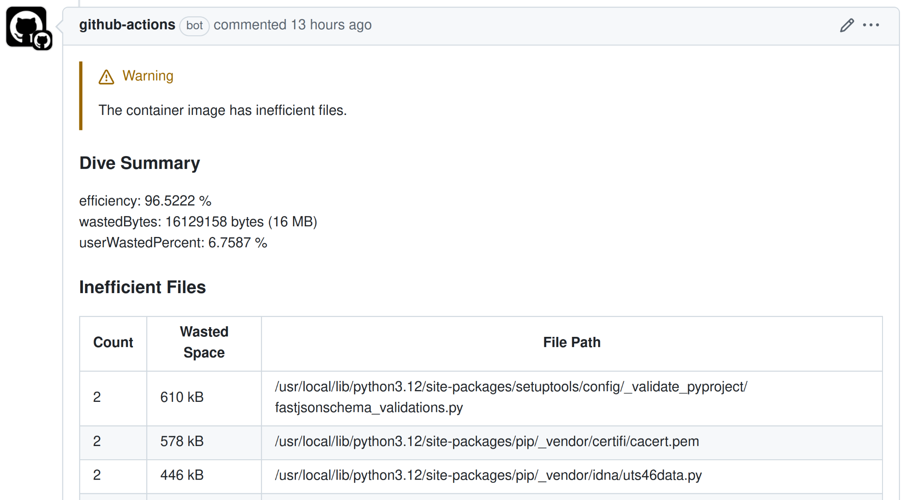

# dive action

[![GitHub Marketplace][marketplace-badge]](https://github.com/marketplace/actions/dive-action-v2)
[![Release][release-badge]](https://github.com/MaxymVlasov/dive-action/releases/latest)  

[![OpenSSF Scorecard Badge]](https://scorecard.dev/viewer/?uri=github.com/MaxymVlasov/dive-action)
[](https://www.bestpractices.dev/projects/10053)  
[![Stand With Ukraine]](https://stand-with-ukraine.pp.ua)
[![Russian Warship Go Fuck Yourself]](https://stand-with-ukraine.pp.ua)


[release-badge]: https://img.shields.io/github/release/MaxymVlasov/dive-action.svg?logo=github&color=green
[marketplace-badge]: https://img.shields.io/badge/marketplace-dive--action--v2-green?logo=github
[license-badge]: https://img.shields.io/github/license/MaxymVlasov/dive-action.svg
[OpenSSF Scorecard Badge]: https://api.scorecard.dev/projects/github.com/MaxymVlasov/dive-action/badge
[Stand With Ukraine]: https://raw.githubusercontent.com/vshymanskyy/StandWithUkraine/main/badges/StandWithUkraine.svg
[Russian Warship Go Fuck Yourself]: https://raw.githubusercontent.com/vshymanskyy/StandWithUkraine/main/badges/RussianWarship.svg

Dive action is a GitHub Action that helps you optimize your container images. It runs an analysis on your Docker or OCI images to identify inefficiencies, such as unnecessary files or wasted space, and then provides clear feedback (for example, via pull request comments) so you can reduce the image size and boost performance.

Under the hood, the [dive](https://github.com/wagoodman/dive) tool inspects image layers to pinpoint areas for improvement. By integrating dive action into your CI pipeline, you can catch inefficiencies early and maintain lean, efficient container images.



* [Usage](#usage)
  * [Workflow](#workflow)
  * [Inputs](#inputs)
    * [Required](#required)
    * [PR comments](#pr-comments)
    * [Used dive image](#used-dive-image)
    * [Dive configs](#dive-configs)
  * [Config file](#config-file)
  * [Output](#output)
* [Authors](#authors)
* [License](#license)
  * [Additional information for users from Russia and Belarus](#additional-information-for-users-from-russia-and-belarus)

Want to contribute?
Check [open issues](https://github.com/MaxymVlasov/dive-action/issues) and [contributing notes](.github/CONTRIBUTING.md).

## Usage

### Workflow

```yaml
name: Dive CI

on:
 pull_request:

jobs:
  dive:
    permissions:
      # for MaxymVlasov/dive-action to write comments to PRs
      pull-requests: write
    runs-on: ubuntu-latest
    name: Analyze image efficiency
    steps:
      - name: Checkout
        uses: actions/checkout@v4
      - name: Build image
        run: docker build -t sample:latest .
      - name: Dive
        uses: MaxymVlasov/dive-action@v1.4.0
        with:
          image: sample:latest
          github-token: ${{ secrets.GITHUB_TOKEN }}
```

For security reasons, I recommend pinning GitHub Action SHAs. You can use
[Renovate](https://docs.renovatebot.com/) for this. The simplest way to start
is by using [this preset](https://github.com/SpotOnInc/renovate-config/) that I
created.


### Inputs

<details><summary>All in alphabetical order</summary>

| Name&nbsp;&nbsp;&nbsp;&nbsp;&nbsp;&nbsp;&nbsp;&nbsp;&nbsp;&nbsp;&nbsp;&nbsp;&nbsp;&nbsp;&nbsp;&nbsp;&nbsp;&nbsp; | Type    | Required | Default | Description&nbsp;&nbsp;&nbsp;&nbsp;&nbsp;&nbsp;&nbsp;&nbsp;&nbsp;&nbsp;&nbsp;&nbsp;&nbsp;&nbsp;&nbsp;&nbsp;&nbsp;&nbsp;&nbsp;&nbsp;&nbsp;&nbsp;&nbsp;&nbsp;&nbsp;&nbsp;&nbsp;&nbsp;&nbsp;&nbsp;&nbsp;&nbsp;&nbsp;&nbsp;&nbsp;&nbsp;&nbsp;&nbsp;&nbsp;&nbsp;&nbsp;&nbsp;&nbsp;&nbsp; |
| ---------------------------------------------------------------------------------------------------------------- | ------- | -------- | ------- | ----------------------------------------------------------------------------------------------------------------------------------------------------------------------------------------------------------------------------------------------------------------------------------- |
| image                     | String  | true     |                                                                                        | Image to analyze                                                                                                                                                                                                                                                           |
| always-comment            | Boolean | false    | `false`                                                                                | Post dive analysis results as PR comment regardless of whether any inefficiencies were found. By default, comments are only posted when issues are detected. Requires `github-token`                                                                                       |
| config-file               | String  | false    | `${{ github.workspace }}/.dive.yaml`                                                   | Path to [dive config file](https://github.com/wagoodman/dive#ci-integration).  If not provided, default Dive settings will be used. Individual parameters `min-image-efficiency`, `max-wasted-ratio`, and `max-wasted-bytes` can override settings specified in `config-file` |
| github-token              | String  | false    |                                                                                        | GitHub token to post PR comment with dive analysis                                                                                                                                                                                                                         |
| dive-image-registry       | String  | false    | `ghcr.io/wagoodman/dive`                                                                  | Docker registry to pull the Dive image from                                                                                                                                                                                                                                |
| dive-image-version        | String  | false    | `v0.13.1@sha256:f1886e6c32c0` `94fc41a623c1989f5cb3e48aa7` `66da5f0be233f911fc1d85ce10` | Version of the Dive docker image to use. <br> While `latest` is supported, using a specific version with SHA is recommended for security and reproducibility                                                                                                               |
| highest-wasted-bytes      | String  | false    |                                                                                        | Threshold for the maximum allowed bytes wasted expressed in B, KB, MB and GB                                                                                                                                                                                               |
| highest-user-wasted-ratio | Float   | false    |                                                                                        | Threshold for the maximum allowed ratio wasted bytes as a function of total image size expressed as a ratio between 0-1. Note: the base image layer is NOT included in the total image size                                                                                |
| lowest-efficiency-ratio   | Float   | false    |                                                                                        | Threshold for the lowest allowed image efficiency ratio between 0-1                                                                                                                                                                                                        |

</details>


#### Required

| Name  | Type   | Required | Default | Description      |
| ----- | ------ | -------- | ------- | ---------------- |
| image | String | true     |         | Image to analyze |

#### PR comments

| Name           | Type    | Required | Default | Description                                                                                                                                                                          |
| -------------- | ------- | -------- | ------- | ------------------------------------------------------------------------------------------------------------------------------------------------------------------------------------ |
| always-comment | Boolean | false    | `false` | Post dive analysis results as PR comment regardless of whether any inefficiencies were found. By default, comments are only posted when issues are detected. Requires `github-token` |
| github-token   | String  | false    |         | GitHub token to post PR comment with dive analysis                                                                                                                                   |

#### Used dive image

| Name&nbsp;&nbsp;&nbsp;&nbsp;&nbsp;&nbsp;&nbsp;&nbsp;&nbsp;&nbsp;&nbsp;&nbsp;&nbsp;&nbsp;&nbsp;&nbsp;&nbsp;&nbsp;&nbsp;&nbsp;&nbsp; | Type   | Required | Default | Description&nbsp;&nbsp;&nbsp;&nbsp;&nbsp;&nbsp;&nbsp;&nbsp;&nbsp;&nbsp;&nbsp;&nbsp;&nbsp;&nbsp;&nbsp;&nbsp;&nbsp;&nbsp;&nbsp;&nbsp;&nbsp;&nbsp;&nbsp;&nbsp;&nbsp;&nbsp;&nbsp;&nbsp;&nbsp;&nbsp;&nbsp;&nbsp;&nbsp;&nbsp;&nbsp;&nbsp;&nbsp;&nbsp;&nbsp;&nbsp;&nbsp;&nbsp;&nbsp;&nbsp; |
| ---------------------------------------------------------------------------------------------------------------------------------- | ------ | -------- | ------- | ----------------------------------------------------------------------------------------------------------------------------------------------------------------------------------------------------------------------------------------------------------------------------------- |
| dive-image-registry | String | false    | `ghcr.io/wagoodman/dive`                                                                  | Docker registry to pull the Dive image from                                                                                                                  |
| dive-image-version  | String | false    | `v0.13.1@sha256:f1886e6c32c0` `94fc41a623c1989f5cb3e48aa7` `66da5f0be233f911fc1d85ce10` | Version of the Dive docker image to use. <br> While `latest` is supported, using a specific version with SHA is recommended for security and reproducibility |

#### Dive configs

| Name                      | Type   | Required | Default                              | Description                                                                                                                                                                                                                                                                  |
| ------------------------- | ------ | -------- | ------------------------------------ | ---------------------------------------------------------------------------------------------------------------------------------------------------------------------------------------------------------------------------------------------------------------------------- |
| config-file               | String | false    | `${{ github.workspace }}/.dive.yaml` | Path to [dive config file](https://github.com/wagoodman/dive#ci-integration). If not provided, default Dive settings will be used.<br>Individual parameters `min-image-efficiency`, `max-wasted-ratio`, and `max-wasted-bytes` can override settings specified in `config-file` |
| highest-wasted-bytes      | String | false    |                                      | Threshold for the maximum allowed bytes wasted expressed in B, KB, MB and GB                                                                                                                                                                                                 |
| highest-user-wasted-ratio | Float  | false    |                                      | Threshold for the maximum allowed ratio wasted bytes as a function of total image size expressed as a ratio between 0-1. Note: the base image layer is NOT included in the total image size                                                                                  |
| lowest-efficiency-ratio   | Float  | false    |                                      | Threshold for the lowest allowed image efficiency ratio between 0-1                                                                                                                                                                                                          |

Dive configs priority:

1. `highest-wasted-bytes`, `highest-user-wasted-ratio`, `lowest-efficiency-ratio`
2. `config-file`
3. Default dive settings:
    * highestUserWastedPercent: 0.1
    * highestWastedBytes: disabled
    * lowestEfficiency: 0.9

### Config file

There are three metrics supported by the dive config file. See [here](https://github.com/wagoodman/dive#ci-integration) for details.

```yaml
rules:
  # If the efficiency is measured below X%, mark as failed.
  # Expressed as a ratio between 0-1.
  lowestEfficiency: 0.95

  # If the amount of wasted space is at least X or larger than X, mark as failed.
  # Expressed in B, KB, MB, and GB.
  highestWastedBytes: 20MB

  # If the amount of wasted space makes up for X% or more of the image, mark as failed.
  # Note: the base image layer is NOT included in the total image size.
  # Expressed as a ratio between 0-1; fails if the threshold is met or crossed.
  highestUserWastedPercent: 0.20
```

### Output

```txt
ghcr.io/wagoodman/dive@sha256:f1886e6c32c094fc41a623c1989f5cb3e48aa766da5f0be233f911fc1d85ce10: Pulling from wagoodman/dive
54c3c928c034: Pulling fs layer
54c3c928c034: Verifying Checksum
54c3c928c034: Download complete
54c3c928c034: Pull complete
Digest: sha256:f1886e6c32c094fc41a623c1989f5cb3e48aa766da5f0be233f911fc1d85ce10
Status: Downloaded newer image for ghcr.io/wagoodman/dive@sha256:f1886e6c32c094fc41a623c1989f5cb3e48aa766da5f0be233f911fc1d85ce10
ghcr.io/wagoodman/dive:v0.13.1@sha256:f1886e6c32c094fc41a623c1989f5cb3e48aa766da5f0be233f911fc1d85ce10
  Using CI config: /.dive-ci
Image Source: docker://sample:latest
Fetching image... (this can take a while for large images)
Analyzing image...
  efficiency: 98.8091 %
  wastedBytes: 11697960 bytes (12 MB)
  userWastedPercent: 1.6116 %
Inefficient Files:
Count  Wasted Space  File Path
    6        4.9 MB  /var/cache/debconf/templates.dat
    4        3.2 MB  /var/cache/debconf/templates.dat-old
    6        1.2 MB  /var/lib/dpkg/status
    6        1.2 MB  /var/lib/dpkg/status-old
    5        400 kB  /var/log/dpkg.log
    5        211 kB  /var/log/apt/term.log
    6        107 kB  /etc/ld.so.cache
    6         83 kB  /var/cache/debconf/config.dat
    6         71 kB  /var/lib/apt/extended_states
    6         67 kB  /var/log/apt/eipp.log.xz
    5         54 kB  /var/cache/ldconfig/aux-cache
    4         40 kB  /var/cache/debconf/config.dat-old
    5         39 kB  /var/log/apt/history.log
    4         26 kB  /var/log/alternatives.log
    2        9.1 kB  /etc/mailcap
    2         903 B  /etc/group
    2         892 B  /etc/group-
    2         756 B  /etc/gshadow
    2         727 B  /var/lib/dpkg/triggers/File
    2           0 B  /usr/src
    6           0 B  /var/lib/dpkg/lock-frontend
    6           0 B  /var/lib/dpkg/lock
    5           0 B  /var/lib/apt/lists
    3           0 B  /var/lib/dpkg/triggers/Unincorp
    6           0 B  /var/lib/dpkg/updates
Results:
  PASS: highestUserWastedPercent
  PASS: highestWastedBytes
  FAIL: lowestEfficiency: image efficiency is too low (efficiency=0.988091457351898 < threshold=0.99)
Result:FAIL [Total:3] [Passed:2] [Failed:1] [Warn:0] [Skipped:0]

##[error]Process completed with exit code 1.
```

## Authors

This action was originally created by [Yuichi Tanaka](https://github.com/yuichielectric), but [upstream](https://github.com/yuichielectric/dive-action/) not maintained since 2020.

Now it supported by [Maksym Vlasov](https://github.com/MaxymVlasov) with help from these awesome contributors:

<a href="https://github.com/MaxymVlasov/dive-action/graphs/contributors">
  
</a>

## License

MIT licensed. See [LICENSE](LICENSE) for full details.

### Additional information for users from Russia and Belarus

* Russia has [illegally annexed Crimea in 2014](https://en.wikipedia.org/wiki/Annexation_of_Crimea_by_the_Russian_Federation) and [brought the war in Donbas](https://en.wikipedia.org/wiki/War_in_Donbas) followed by [full-scale invasion of Ukraine in 2022](https://en.wikipedia.org/wiki/2022_Russian_invasion_of_Ukraine).
* Russia has brought sorrow and devastations to millions of Ukrainians, killed hundreds of innocent people, damaged thousands of buildings, and forced several million people to flee.
* [Putin khuylo!](https://en.wikipedia.org/wiki/Putin_khuylo!)
